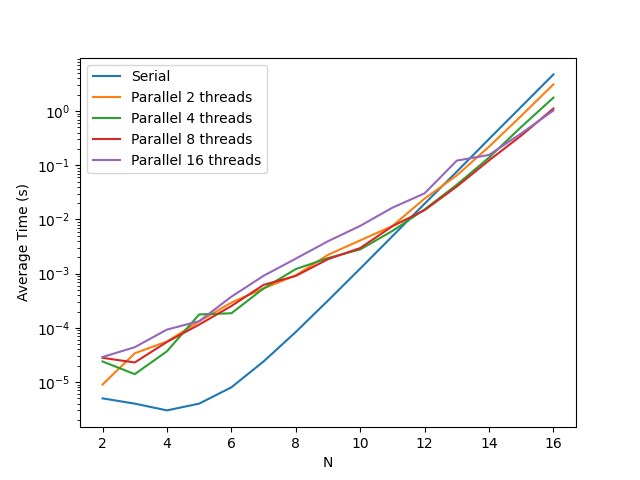
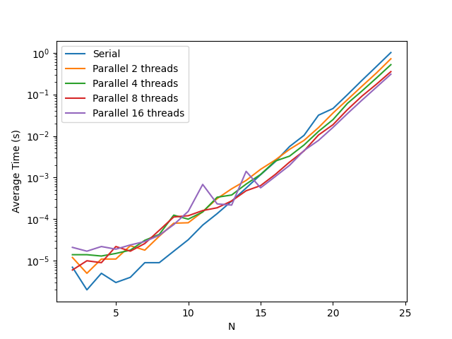
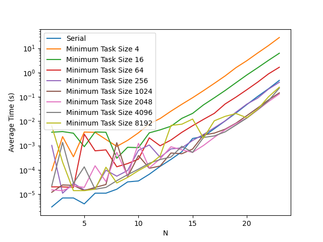
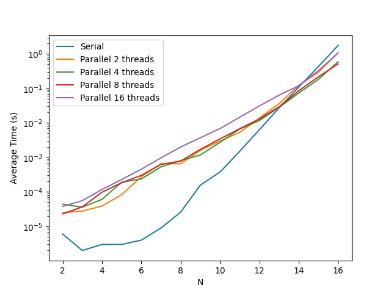

# Group Participants
- Jules SEBAN (jules.seban@etu.univ-grenoble-alpes.fr)
- Thilen SAVIGNON (thilen.savignon@etu.univ-grenoble-alpes.fr)

# Exercices
## Bubble Sort
We first implemented the sequential and parallel algorithms using the provided pseudo-code and hints.
The parallel algorithm splits the input array into a number of chunks corresponding to the number of available threads. The size of every chunk but the last one is `array_size % num_chunks`. The last chunk contains the remaining elements (`chunk_size + array_size / num_chunks`). A more efficient distribution of values accross chunks could be implemented to better take advantage of the parallelization but we lacked the time to implement it.
The algorithm then applies one iteration of the Bubble algorithm per chunk, in parallel, then check the boundaries between chunks for potential swaps (parallelization of that step does not seems to significantly improve performaces overall, and with lower thread counts, it introduces to much overhead).

## Merge Sort
We completed the serial Merge Sort as specified by the algorithm. For the parallel algorithm we simply created tasks using OpenMP (while making sure they run only once) and applied our improvement, which consists in only creating a subtask when the size of the subarray is greater than a threshold (which we pinpointed to 1024 after some tests). The point of running in sequential below this threshold is to limit the overhead of creating tasks.

## Odd-Even Sort
a- In the Odd-Even Sort algorithm, different iterations of the same loop are independant from each other, due to the loop offset of 2.
This means that unlike in the Bubble Sort, we can parallelize both `for` loops of the serial implementation, without risking data conflict.

b- The serial implementation of this algorithm is rather straight-forward and is similar to the pseudo-code given in the lab subject.

c- The parallel implementation of the Odd-Even Sort is simply a copy of the sequential implementation with parallelization OpenMP pragmas added to the loops.

# Performance Analysis Notes
We ran the different tests on the Mandelbrot servers. We also tested the different algorithms with random initialization of the arrays, and already sorted sequences of numbers, but they both did not conclude in any major difference. Only the Bubble Sort was significantly faster with sorted sequences (which made parallelization unrelevant for this case).
